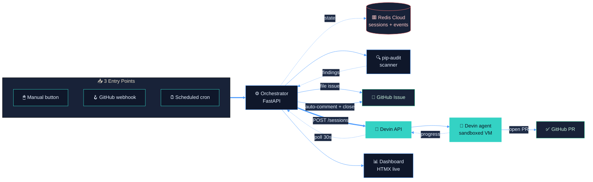

<div align="center">


# Superset Auto-Remediation

**Event-driven dependency-CVE remediation pipeline for Apache Superset, powered by the Devin API.**

*Scanners find facts. Devin makes judgments and ships the PRs.*

<br/>

[](https://devin.ai)
[](https://www.python.org)
[](https://fastapi.tiangolo.com)
[](https://redis.io)
[](https://htmx.org)
[](https://tailwindcss.com)
[](https://docs.docker.com/compose/)
[](#license)

<br/>

**[ Live PR Devin opened →](https://github.com/gacerioni/superset/pull/2)**  ·  **[ Issue auto-managed →](https://github.com/gacerioni/superset/issues/1)**  ·  **[ Architecture →](#architecture)**  ·  **[ Quick start →](#quick-start)**

</div>

---

## 📑 Table of contents

- [Why this exists](#-why-this-exists)
- [Architecture](#-architecture)
- [Key architectural decisions](#-key-architectural-decisions)
- [See it in action](#-see-it-in-action)
- [Quick start](#-quick-start)
- [Tech stack](#-tech-stack)
- [Project layout](#-project-layout)
- [API surface](#-api-surface)
- [Configuration](#-configuration)
- [Demo flow](#-demo-flow-for-evaluators)
- [What's NOT in scope](#-whats-not-in-scope)
- [Extending this](#-extending-this)
- [Author](#-author)

---

## 🎯 Why this exists

> **Renovate and Dependabot raise the version-bump PR. Your engineers still own fixing whatever the bump breaks. That gap is where security debt accumulates.**

This pipeline closes it: **`pip-audit` finds the CVE, Devin does the engineering, your team reviews and merges.**

Built as a Forward-Deployed-Engineer style engagement demo on top of the [Devin API](https://docs.devin.ai/api-reference/overview). A scheduled scan — or a click, or a GitHub webhook — finds CVEs in Superset's pinned packages, files a structured GitHub issue, and dispatches a Devin session that reads the changelog, fixes breaking changes, opens a PR, and reports back on the issue. All observable from a live dashboard.

---

## 🏗 Architecture



---

## 🧱 Key architectural decisions

| # | Decision | Rationale |
|---|---|---|
| **1** | **Scanner outside Devin** | `pip-audit` runs in 2 seconds and costs nothing. Devin's value is in the *fix*, not the *find* — putting Devin on scanning would be lighting ACU on fire to do work a script already does. |
| **2** | **Hard ACU cap per session** | `max_acu_limit=3` (~$6.75 worst case). Runaway sessions are bounded before they start. |
| **3** | **Structured output required** | Every Devin session must return JSON matching a schema we define. No parsing chat logs to figure out outcomes. |
| **4** | **Two channels, one source of truth** | The GitHub issue is the human audit trail (security, compliance, queue review). The Devin API receives the prompt directly — same data, agent-formatted, no redundant scraping. |
| **5** | **Polling, not webhooks** | Devin's API doesn't push state changes. A 30-second background poller hydrates Redis from `GET /sessions/{id}` and emits events. |
| **6** | **Idempotent dedupe** | Scanner skips CVEs that already have a `devin-remediate` issue (open OR closed). Safe to re-trigger between demo takes. |

Detailed reasoning, tradeoffs, and "what I considered but rejected" live in [`PLAN.md`](PLAN.md).

---

## 🎬 See it in action

These artifacts are **real outputs from the running pipeline** — click around without spinning up anything locally:

<table>
<tr>
<td width="33%" valign="top">

### 🎯 The PR Devin opened
**[`gacerioni/superset#2`](https://github.com/gacerioni/superset/pull/2)**

Fixes `CVE-2026-27205` in Flask. Devin **auto-discovered** the cascading bumps required in `flask-babel` and `flask-sqlalchemy` (both pre-3.0 versions import internals removed in Flask 3), bumped all three in one coherent PR, and ran 15 targeted tests.

</td>
<td width="33%" valign="top">

### 🐛 The auto-managed issue
**[`gacerioni/superset#1`](https://github.com/gacerioni/superset/issues/1)**

Filed by the orchestrator with structured CVE payload. After Devin finished, the poller commented back with the PR link + ACU cost + Devin session URL, then closed the issue — full audit trail with zero human intervention.

</td>
<td width="33%" valign="top">

### 🧠 The Devin session
**[Session log on app.devin.ai →](https://app.devin.ai/sessions/90cb2c05dbed47e3b4ff9acb0424b103)**

Every step Devin took, replayable. Read the prompt, watch him clone the repo, read the Flask changelog, identify the breaking imports, push the branch, open the PR. Auditability is a feature, not a footnote.

</td>
</tr>
</table>

---

## 🚀 Quick start

### Prerequisites

- 🐳 **Docker** + Docker Compose
- 🔑 A **Devin API key** (`cog_...`) from [app.devin.ai → Settings → API](https://app.devin.ai)
- 🔐 A **GitHub PAT** with `repo` scope
- 📦 A **Redis Cloud database URL** (free tier 30 MB is fine), OR use the bundled `local-redis` profile

### Run it

```bash
git clone https://github.com/gacerioni/superset-devin-autoremediation
cd superset-devin-autoremediation

cp .env.example .env
# edit .env — fill in DEVIN_API_KEY, DEVIN_ORG_ID, GITHUB_TOKEN, GITHUB_REPO, REDIS_URL

# Bring up the stack (uses Redis Cloud from your .env)
docker compose up --build

# Or include a local Redis Stack container instead of Redis Cloud
make up-local-redis
```

Then open:

- 📊 **Dashboard** → [http://localhost:8501](http://localhost:8501)
- 📘 **Orchestrator API docs** → [http://localhost:8080/docs](http://localhost:8080/docs)

### Clone the target repo (one-time)

The orchestrator runs `pip-audit` against a local copy of the Superset fork. Pull it shallow into `./workspace/`:

```bash
mkdir -p workspace && cd workspace
git clone --depth 1 https://github.com/gacerioni/superset.git
```

### Trigger the pipeline

From the dashboard, click **"Run security scan"** (Control Panel section).

Or via curl:

```bash
curl -X POST "http://localhost:8080/trigger/scan?dispatch=true&max_issues=1"
```

What happens:

1. A new issue appears in `gacerioni/superset` (or your `GITHUB_REPO`)
2. A new session row appears on the dashboard, status `queued` → `running`
3. Click the **Devin** column link → watch Devin live on `app.devin.ai`
4. 8–14 minutes later: PR appears, issue auto-commented + closed, dashboard tiles update

---

## 🛠 Tech stack

<div align="center">

| Layer | Choice | Why |
|---|---|---|
| **Backend** | FastAPI + httpx (async) | Native async story for I/O-bound work (Devin API + Redis + GitHub) |
| **Storage** | Redis Cloud (with TimeSeries) | Sub-ms reads for live dashboard; TimeSeries for throughput metrics |
| **Frontend** | FastAPI + Jinja2 + Tailwind (CDN) + HTMX | Server-rendered, zero JS framework, ~5s live updates without WebSockets |
| **Container** | docker-compose | Single command spin-up; optional local-redis profile |
| **Devin SDK** | Bare httpx against `api.devin.ai/v3` | Type-safe Pydantic models, no SDK lock-in |
| **Scanner** | `pip-audit` (PyPA) | Industry standard, deterministic, runs in 2 seconds |
| **GitHub** | `PyGithub` | Reliable, well-typed, used for issues + comments + label management |
| **Logging** | `structlog` (JSON) | Production-ready, auditable, machine-greppable |

</div>

---

## 📁 Project layout

```
.
├── orchestrator/              # FastAPI service — the brain
│   ├── app/
│   │   ├── main.py            # routes: /trigger/scan, /webhook/github, /trigger/smoke
│   │   ├── orchestrator.py    # CVE → Devin session dispatch
│   │   ├── scanner.py         # pip-audit runner + GitHub issue filer
│   │   ├── devin_client.py    # async httpx client for api.devin.ai/v3
│   │   ├── poller.py          # background task: poll Devin → hydrate Redis → comment back
│   │   ├── mock_devin.py      # in-process mock API for dev without ACU
│   │   ├── prompts.py         # the prompt template Devin receives per CVE
│   │   ├── storage.py         # Redis layer (sessions, events, TimeSeries)
│   │   ├── models.py          # Pydantic models
│   │   ├── config.py          # settings loader
│   │   └── logging_config.py  # structured JSON logs
│   ├── Dockerfile
│   └── requirements.txt
│
├── dashboard/                 # Visual centerpiece
│   ├── main.py                # FastAPI server with HTMX partials
│   ├── templates/             # Jinja templates (base, index, partials)
│   ├── static/                # Devin logo, real brand SVGs, GitHub avatar
│   ├── Dockerfile
│   └── requirements.txt
│
├── scripts/
│   ├── reset_for_demo.sh      # idempotent reset between Loom takes
│   └── seed_demo_sessions.py  # pre-populate Redis with realistic sessions (dev only)
│
├── workspace/                 # gitignored — the cloned Superset fork (~440MB)
│   └── superset/
│
├── docker-compose.yml         # orchestrator + dashboard (+ optional local-redis)
├── Makefile                   # make up / make trigger / make reset
├── PLAN.md                    # full design doc + architectural decisions
├── .env.example
└── README.md
```

---

## 🔌 API surface

<details>
<summary><strong>Click to expand orchestrator endpoints</strong></summary>

Full schema available at `/docs` when the stack is running.

| Method | Path | Purpose |
|---|---|---|
| `POST` | `/trigger/scan` | Run pip-audit, file issues, dispatch Devin (one-stop) |
| `POST` | `/trigger/dispatch` | Manually dispatch Devin for a specific CVE id |
| `POST` | `/trigger/smoke` | Tiny Devin session to validate API connectivity (~$0) |
| `POST` | `/webhook/github` | GitHub webhook receiver for `issues:opened` events |
| `POST` | `/poll/now` | Force an immediate Devin poll (useful during demos) |
| `GET` | `/api/sessions` | List sessions (powers the dashboard) |
| `GET` | `/api/events` | Tail recent state-transition events |
| `DELETE` | `/api/sessions/{id}` | Cancel a running Devin session |

</details>

---

## ⚙️ Configuration

`.env.example` documents every variable. The ones you actually need to fill in:

| Variable | What | Where to get |
|---|---|---|
| `DEVIN_API_KEY` | Devin API key (prefix `cog_`) | app.devin.ai → Settings → API |
| `DEVIN_ORG_ID` | Devin organization id (prefix `org-`) | app.devin.ai → Settings → Organization |
| `DEVIN_MODE` | `real` for production, `mock` for local dev with no key | — |
| `DEVIN_MAX_ACU_PER_SESSION` | Hard cap per session (default `3`) | — |
| `GITHUB_TOKEN` | PAT with `repo` scope | github.com → Settings → Developer settings |
| `GITHUB_REPO` | Target repo for issues + PRs (e.g. `gacerioni/superset`) | — |
| `REDIS_URL` | Connection string (TLS recommended: `rediss://...`) | Redis Cloud console |

---

## 🎥 Demo flow (for evaluators)

To reproduce the demo end-to-end:

```bash
# 1. Stack up
docker compose up --build -d

# 2. Reset to a clean demo state (1 completed session visible, fork issue closed)
bash scripts/reset_for_demo.sh

# 3. Open dashboard
open http://localhost:8501

# 4. Click "Run security scan" — the pipeline runs live
```

The reset script is **idempotent** — safe to re-run between takes.

---

## 🚫 What's NOT in scope

These were considered and deliberately deferred. Reasoning lives in [`PLAN.md`](PLAN.md):

- ❌ **PR auto-merge** — humans merge. Devin Review API closes the review loop, but the human is the final gate.
- ❌ **Letting Devin read the GitHub issue** — redundant. Orchestrator hands the same data via the API in agent-formatted form.
- ❌ **Letting Devin run the scanner** — `pip-audit` costs nothing, takes 2 seconds. No value-add from putting it inside a session.
- ❌ **Multi-repo fan-out** — a real engagement would shard this across the customer's portfolio. Out of scope for a 5-day take-home.

---

## 🚀 Extending this

Same orchestrator, swap the prompt — the playbook lives in `prompts.py`. Applies cleanly to:

- 🔄 **Strategic migrations** — SQLAlchemy 1→2, Pydantic 1→2, framework cutovers
- 🧹 **Quality uplift** — mypy strict-mode rollout, flaky test triage
- 📜 **Compliance refactors** — license header sweeps, code style migrations
- 🚀 **Feature acceleration** — bounded features under ~3 engineer-hours each

---

## 👤 Author

<div align="center">


### Gabriel Cerioni

**Forward Deployed Engineer · Redis**

[](https://br.linkedin.com/in/gabrielcerioni/)
[](https://github.com/gacerioni)

</div>

---

## 📄 License

MIT — see [`LICENSE`](LICENSE) (or the badge above).

---

<div align="center">

*Built as a Cognition take-home challenge. Devin is the protagonist; the orchestrator is just glue.*

</div>
